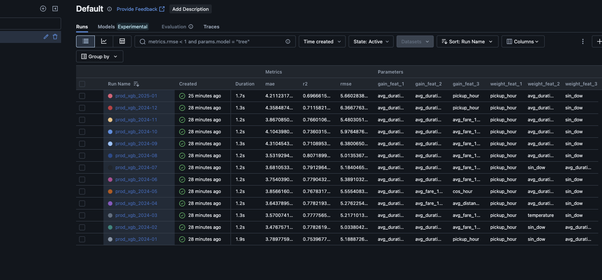

# 🗽 NYC Taxi ML Pipeline

A full-stack machine learning pipeline to predict NYC taxi trip duration.

**Designed for:** clarity, reproducibility, and real-world ML infra readiness — with lean setup for cloning.

---
## Project Summary

This is a solo project built as a demonstration of end-to-end ML workflow using NYC Taxi data.  
All data processing, modeling, and documentation were done by me.

Data Source: NYC Taxi Dataset (https://www.nyc.gov/site/tlc/about/tlc-trip-record-data.page)  
Weather Data: Open-Meteo API (https://open-meteo.com)  


## 📘 Reports

- 🗒️ [Notion Summary Report](https://bitter-aster-788.notion.site/NYC-Taxi-ETA-Forecasting-Modeling-Meets-Real-World-Chaos-2248b64123bf805991cae210535ab3c7) *(stakeholder view – business insights)*
- 📓 [Notebook Spark Walkthrough](spark_full/spark_eta_model.ipynb) *(Spark ML version – deep dive)*


---

## 🧭 Project Evolution

> **Prototyped in Spark. Delivered in pandas.**

The project began with a full **Spark-based workflow** for processing large-scale NYC TLC data, using:

- 🔹 Spark for prototyping data transformations and rolling aggregations  
- 🔹 dbt for SQL-style modeling  
- 🔹 Dagster for orchestration (optional)

However, for simplicity, speed, and **ease of cloning**, we **ported the full pipeline to Python + pandas**.

### ✅ Why pandas for final version?

- ⚡ Lightweight: no Spark setup or cluster needed
- 💻 Local-friendly: works out-of-the-box via `python main.py`
- 🔁 Same logic: All Spark SQL logic reimplemented using pandas
- 📦 Portable: Easy to fork, run, and adapt


Both versions are maintained:

- **`/spark_full/`** folder — full Spark/dbt version
- **Root folder** — lean pandas version for reproducibility and demo


## 🚀 Quickstart

> 📌 **Recommended Python version**: 3.10

Set up and run the full pipeline locally with no cluster needed ( Recommended for Mac User)

```bash
# 1. Create virtual environment
python3.10 -m venv nyc_taxi
source nyc_taxi/bin/activate  

# 2. Install dependencies
pip install -r requirements.txt

# 3. Run test mode (quick demo)
python main.py --mode= est
# ✅ Ingest Jan–Apr 2024
# ✅ Train model for April 2024
# ✅ Good for validating setup + MLflow run

# 4. Run full pipeline (bulk mode)
python main.py --mode bulk
# ✅ Process all 2023–2024 data
# ✅ Build rolling features
# ✅ Train + log monthly models

# 5. Ingest new data (incremental)
python main.py --mode incremental --year 2025 --month 1
# ✅ Add new month (e.g. Jan 2025)
# ✅ Update features + retrain model

# 6. Launch MLflow dashboard
mlflow ui
# → http://localhost:5000

```
---

## 📂 Project Structure

```text
nyc-taxi-ml-pipeline/
├── data/                            # Raw and processed datasets
│   ├── bronze/                      # Raw ingested files
│   ├── silver/                      # Cleaned + enriched datasets
│   └── gold/                        # Final ML-ready feature tables
│
├── etl/                             # Scripts for data ingestion and transformation 
│   ├── bronze.py                    # Data ingestion
│   └── silver.py                    # Ligh transform, downsizing 
│   └── gold.py                      # Enriched, ultilized DUCKDB
│
├── models/                          # Scripts for model building
│   ├── configs.py                   # Constant variables, Tuned hyperparameters
│   └── evaluates.py                 # Metrics, Feature Importances
│   └── prepare.py                   # Train test split, Encoding
│
├── pipeline/                        # Combine everything together
│   ├── ml_pipeline.py               # Build Model, save results to MLFLow
│   ├── pipeline.py                  # Bronze -> Silver -> Gold
│
├── spark_full/                      # Spark artifact, dbt, dagster
│
├── main.py                          # Pipeline orchestration entry point
├── Dockerfile                       # Reproducible container setup for pipeline
└── README.md                        # Project overview and usage guide
```

---

## 🔍 Model Overview

After running the pipeline, launch MLflow UI:

```bash
mlflow ui
```
You will see a dashboard like this. CLick on the Columns tab to track metrics( MAE, R2, feature gains/weight)



---

## 🧱 Feature Store Summary

- **Temporal**  
  `pickup_hour`, `is_rush_hour_morning`, `is_weekend`

- **Calendar**  
  `is_holiday`, `is_near_holiday`, `is_payroll_window`

- **Zone & Ride Info**  
  `is_same_zone`, `is_airport_pu_trip`, `passenger_count`

- **Weather** *(by borough & hour)*  
  `temperature`, `precipitation`, `cloudcover`

- **Rolling Aggregates** *(PU-DO pairs)*  
  `avg_duration_min_3mo`, `avg_fare_12mo`, `trip_count_12mo`


---


## 🧰 Tech Stack

- **Compute**: PySpark 3.x, Docker
- **ETL**: Python, dbt
- **ML**: XGBoost, scikit-learn
- **Tracking**: MLflow
- **Data**: NYC TLC, Open-Meteo Archive API
- **Orchestration**: Dagster *(optional, not required for pandas version)*

---


---

Built by [@duytruong1211](https://github.com/duytruong1211) 

