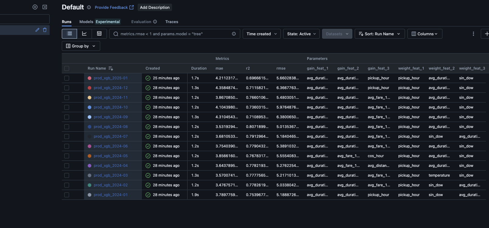

# 🗽 NYC Taxi ML Pipeline


A full-stack machine learning pipeline to predict NYC taxi trip duration.

**Designed for:** clarity, reproducibility, and real-world ML infra readiness — with a lean Docker setup for seamless cloning.

---
## Project Summary

A complete ML workflow built on NYC Taxi data — from raw ingestion to deployment-ready models.

This project blends data engineering, feature store design, and monthly retraining using DuckDB, MLflow, and XGBoost. All packaged into a portable, Dockerized environment.

Originally prototyped in Spark, the final pipeline is optimized in pandas for faster execution and easier forking.

Data Source: NYC Taxi Dataset (https://www.nyc.gov/site/tlc/about/tlc-trip-record-data.page)  
Weather Data: Open-Meteo API (https://open-meteo.com)  


## 📘 Reports

- 🗒️ [Notion Summary Report](https://bitter-aster-788.notion.site/NYC-Taxi-ETA-Forecasting-Modeling-Meets-Real-World-Chaos-2248b64123bf805991cae210535ab3c7) *(stakeholder view – business insights)*
- 📓 [Notebook Spark Walkthrough](spark_full/spark_eta_model.ipynb) *(Spark ML version – deep dive)*


---

## 🧭 Project Evolution

> **Prototyped in Spark. Delivered in pandas.**

Started with a Spark + dbt + Dagster stack for scalability.
Final version is pure Python (pandas) + DuckDB for better speed and usability.

### ✅ Why pandas for final version?

- ⚡ Lightweight: no Spark setup or cluster needed
- 💻 Local-friendly: works out-of-the-box via `python main.py`
- 🔁 Same logic: All Spark SQL logic reimplemented using pandas
- 📦 Portable: Easy to fork, run, and adapt


Both versions are maintained:

- **`/spark_full/`** folder — full Spark/dbt version
- **Root folder** — lean pandas version for reproducibility and demo

## 🚧 Prerequisites

Before you run this project, make sure you have the following installed:

## 🐳 Docker

- [Install Docker Desktop](https://www.docker.com/products/docker-desktop/)  
  (Required for building and running containers)

You can test Docker is working with:

```bash
docker --version
docker-compose --version
```
⚙️ **Performance Tip:** For faster builds, adjust Docker’s CPU and memory limits based on your machine ( Docker Desktop -> Setting -> Resources)

## 🚀 Quickstart
```bash
# ✅ Clone the repo
git clone https://github.com/duytruong1211/nyc-taxi-ml-pipeline.git
cd nyc-taxi-ml-pipeline

# 🔨 One-time build (Takes ~110 sec)
make build

# 🧪 Run test pipeline (quick demo, ~ 55 sec)
make test
# → Ingests Jan–Apr 2024
# → Trains + logs model for April 2024

# 🛠️ Run full historical pipeline (bulk mode, ~6 min 40 sec)
make bulk
# → Ingests + processes all 2023–2024 trips
# → Builds rolling features per PU/DO pair
# → Trains + logs models per month

# 📅 Ingest new data (incremental mode, ~15 sec)
make incremental YEAR=2025 MONTH=1
# → Updates zone-pair features
# → Retrains model for the new month
# → Run chronologically (e.g. Jan → Feb → ...)

# 📊 Launch MLflow UI to track model runs
make ui
# → Open http://localhost:5001 in browser
# Click on the "Columns" tab in the top right to compare metrics like MAE, RMSE, and feature importance.
# 🧼 Cleanup (optional)
make stop             # Stop all containers
make clean            # Stop + remove volumes
make clean-orphans    # Remove leftover run containers

```

---

## 📂 Project Structure

```text
nyc-taxi-ml-pipeline/
├── data/                            # Raw and processed datasets
│   ├── bronze/                      # Raw ingested files
│   ├── silver/                      # Cleaned + enriched datasets
│   └── gold/                        # Final ML-ready feature tables
│
├── etl/                             # Scripts for data ingestion and transformation 
│   ├── bronze.py                    # Data ingestion
│   └── silver.py                    # Ligh transform, downsizing 
│   └── gold.py                      # Enriched, ultilized DUCKDB
│
├── models/                          # Scripts for model building
│   ├── configs.py                   # Constant variables, Tuned hyperparameters
│   └── evaluates.py                 # Metrics, Feature Importances
│   └── prepare.py                   # Train test split, Encoding
│
├── pipeline/                        # Combine everything together
│   ├── ml_pipeline.py               # Build Model, save results to MLFLow
│   ├── pipeline.py                  # Bronze -> Silver -> Gold
│
├── spark_full/                      # Spark artifact, dbt, dagster
│
├── main.py                          # Pipeline orchestration entry point
├── Dockerfile                       # Reproducible container setup for pipeline
└── README.md                        # Project overview and usage guide
```

---

## 🔍 Model Overview

After running the pipeline, launch MLflow UI:

```bash
mlflow ui
```
You will see a dashboard like this. Click on the Columns tab to track metrics( MAE, R2, feature gains/weight)



---

## 🧱 Feature Store Summary

- **Rolling Aggregates** *(PU-DO pairs)*  
  `avg_duration_min_3mo`, `avg_fare_12mo`, `trip_count_12mo`

- **Temporal**  
  `pickup_hour`, `is_rush_hour_morning`, `is_weekend`

- **Calendar**  
  `is_holiday`, `is_near_holiday`, `is_payroll_window`

- **Zone & Ride Info**  
  `is_same_zone`, `is_airport_pu_trip`, `passenger_count`

- **Weather** *(by borough & hour)*  
  `temperature`, `precipitation`, `cloudcover`


---


## 🧰 Tech Stack

- **Compute**: PySpark 
- **ETL**: Python, dbt
- **DB**: DuckDB, Spark dbt warehouse
- **ML**: XGBoost
- **Tracking**: MLflow
- **Data**: NYC TLC, Open-Meteo Archive API
- **Orchestration**: Dagster *(optional, not required for pandas version)*

---


---

Built by [@duytruong1211](https://github.com/duytruong1211) 

